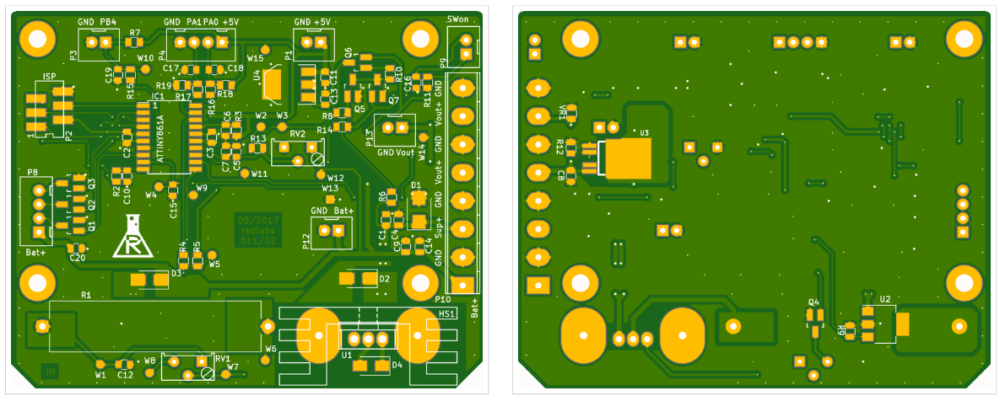

Eigenbau Laderegler für die [Akku Musik Kiste(n)](/blog/musik-kiste/). Die analoge Ladeschaltung für einen Bleiakku mit einem LM317. Der Ladevorgang und die Ausgangsspannung werden über je einem Highside-Switch gesteuert.

* * *

##  Übersicht

- Eingangsspannung: **19VDC** (Laptop Netzteil)
- Ladestrom max. **700mA**
- Ladeverfahren: **C**onstant**C**urrent + **C**onstant**V**oltage
- Batterie Typ: [**Blei-Vlies 12V** **7Ah**](https://www.reichelt.de/Blei-Vlies-Akkus-Yuasa/YU-NP7-12L/3/index.html?ACTION=3&LA=2&ARTICLE=157003&GROUPID=6793&artnr=YU+NP7-12L&SEARCH=%252A)
- Lineare Strom/Spannungs Regelung
- Schaltbarer 3.5A, 12V Last-Ausgang
- Unter-/Überspannungs und Ladezustands Überwachung mit µController
- RGB LED Anzeige für System- / Ladestatus

Bauteile:

- ATtiny261A
- TLE42644 5V LDO
- LM317 Adjustable linear regulator
- BSP452 Charge Highside switch 700 mA
- BTS462T Output Highside switch 3.5 A

* * *

##  Schaltungsbeschreibung

- Der µC
    - steuert das Ladeverfahren (off -> CC -> CV -> full)
    - aktiviert / deaktiviert die Ausgangsspannung (je nach ON/OFF Schalter, Unter-/Überspannung)
    - steuert die Status LEDs (12V RGB-LED strip)
- Der Ladevorgang und die Ausgangsspannung werden mit je einem Highside-Switch aktiviert / deaktiviert
- Die analoge Ladeschaltung mit dem LM317
    - kann digital zwischen konstant-Strom (CC) und konstant-Spannung (CV) umgeschalten warden
    - ist auf 700mA / 13.8V eingestellt

 

Der KiCAD Schaltplan als PDF: 
[Laderegler 011-02](Laderegler-LM317-011-02.pdf)

PCB: 
[Bestellen über Redlabs](/kontakt/) / [Bestellen über Aisler](https://aisler.net/p/OSFNUOVD)

